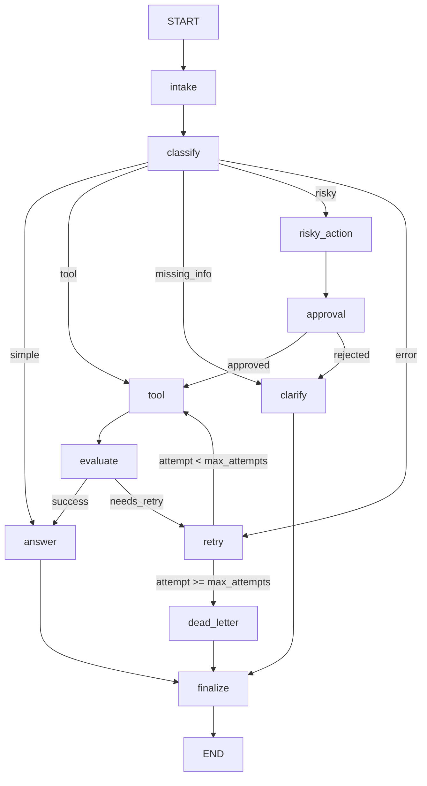

# LangGraph Agent Lab Report

## Metrics Summary

| Metric | Value |
|---|---:|
| Total scenarios | 7 |
| Success rate | 100.00% |
| Average nodes visited | 6.43 |
| Total retries | 3 |
| Total interrupts/approvals | 2 |
| Resume success | True |

## Graph Architecture

The graph uses LangGraph conditional edges for classification, approval, tool
evaluation, and bounded retry routing. This keeps control flow explicit and
prevents hidden scenario-specific branching.

## State Schema

`AgentState` keeps scalar workflow decisions as overwrite fields and audit data
as append-only reducer fields. The key overwrite fields are `route`,
`risk_level`, `attempt`, `max_attempts`, `evaluation_result`, `pending_question`,
`proposed_action`, `approval`, and `final_answer`. The append-only fields are
`messages`, `tool_results`, `errors`, and `events`.

This design keeps the state serializable for checkpointing while preserving a
complete event trail for grading and debugging.

## Scenario Results

| Scenario | Success | Expected | Actual | Nodes | Retries | Approval observed |
|---|---|---|---|---:|---:|---|
| S01_simple | yes | simple | simple | 4 | 0 | no |
| S02_tool | yes | tool | tool | 6 | 0 | no |
| S03_missing | yes | missing_info | missing_info | 4 | 0 | no |
| S04_risky | yes | risky | risky | 8 | 0 | yes |
| S05_error | yes | error | error | 10 | 2 | no |
| S06_delete | yes | risky | risky | 8 | 0 | yes |
| S07_dead_letter | yes | error | error | 5 | 1 | no |

## LLM Integration

All model calls go through the Gemini-only `get_llm()` helper. The
`classify_node` uses Gemini structured output to produce one of `simple`, `tool`,
`missing_info`, `risky`, or `error`. The `answer_node` uses Gemini to generate a
grounded final response from the query, tool results, and approval context.

## Persistence Evidence

The lab config uses SQLite checkpointing at `outputs/checkpoints.sqlite`.
Scenario runs pass a unique `thread_id` such as `thread-S01_simple`, and the CLI
checks `graph.get_state_history()` after execution. `resume_success` is set to
`True` when checkpoint history is observable.

## Failure Analysis

Transient tool failures are detected by `evaluate_node` and routed through a
bounded retry loop. When retry attempts reach `max_attempts`, the request goes to
dead letter instead of looping forever.

Risky requests are separated before tool execution. The approval node records a
mock approval by default so automated runs are deterministic, while keeping a
path open for real LangGraph interrupts.

Vague requests are routed to clarification instead of answer generation. This
reduces hallucination risk by asking for the missing account, order, or issue
details before taking action.

## Improvement Plan

- Replace the mock tool with real support-system integrations.
- Add LLM-as-judge evaluation for richer tool quality checks.
- Add a small approval UI for real human-in-the-loop review.
